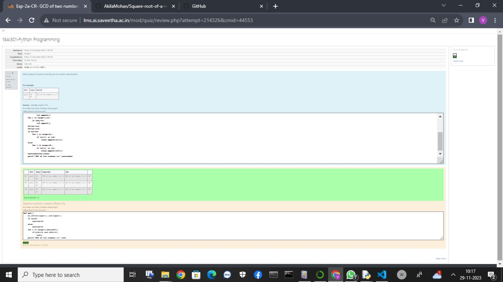

# Find the square root of a number

## AIM:
To write a program to find the square root of a number.

## Equipments Required:
1. Hardware – PCs
2. Anaconda – Python 3.7 Installation / Moodle-Code Runner

## Algorithm
1. Define a function.
2. Assign number_iters = 100 in the function to perform 100 iteratios.
3. Set i = 0.
4. Calculate  number = 0.5 * (number + a / number) for 100 iterations.
5. Return number

## Program:
```
/*
Program to find the square root for the given number(newton's method) using function.
Developed by: vikamuhan.n
RegisterNumber:  23012418
```py 
# GCD of the number
#developed by :N.vikamuhan
#register number:23012418
def gcd():
    n1=int(input())
    n2=int(input())
    ln1=[]
    ln2=[]
    lnmax=[]
    for i in range(1,n1):
        if n1%i==0:
            ln1.append(i)
    for j in range(1,n2):
        if n2%j==0:
            ln2.append(j)
    m1=len(ln1)
    m2=len(ln2)
    if m1>=m2:
        for i in range(m1):
            if ln1[i] in ln2:
                lnmax.append(ln1[i])
    else:
        for i in range(m2):
            if ln2[i] in ln1:
                lnmax.append(ln2[i])
    maxnumber=max(lnmax)
    print("GCD of two numbers is:",maxnumber)            

*/
```

## Output:



## Result:
Thus the program to find the square root for the given number(newton's method) using function is written and verified using python programming.
